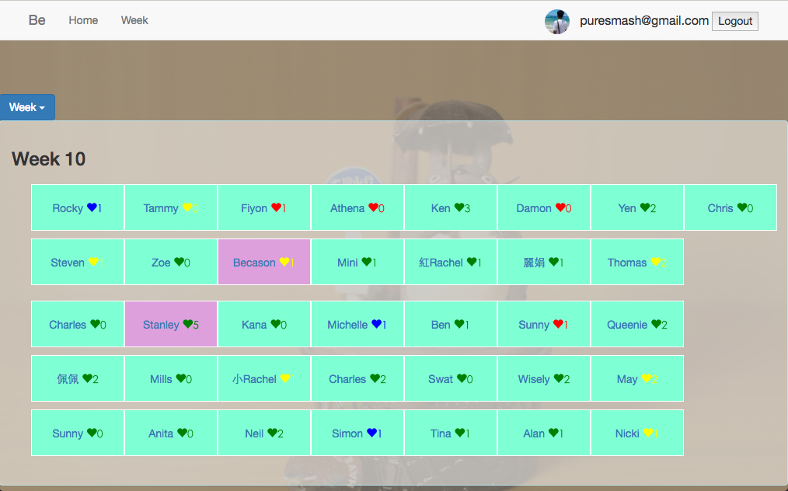

## About

This project demo how to access Google Drive's metadata with Google single sign-on. It is powered by Angular.js and Node.js.

This project was first using in a class last summer. And it is my first project develop by MEAN stack(but I replace Mongo with MySQL). In that course, everyone should take the responsibility for ensuring each other whether they submit their schedule on time every week. With the need to make the checking process easier and to practice my newly learned javascript skill. I decide to construct this tool to check the hand-in rate each week, so we can remind each other when they are in trouble.



## Installation

```sh
# If you didn't install bower before, run the following shell.
npm install -g bower

# Install front-end dependencies using bower
bower install

# Install node modules
npm install

# Create the customized files
mkdir credentials
cd credentials/
vi client_secret.json
cd ..
vi credentials.js

# compile scss
npm run sass
```

At last, if you want to run it on production mode, remember to set the env variable `NPM_CONFIG_PRODUCTION=false`

## Usage

* File `properties/memberList.json` is used to store team structure and the following is its example:

```json
{
    "1": {
        "mAry": [
                 { "id": 2, "nickname": "Tammy" },
                 { "id": 1, "nickname": "Rocky" },
                 { "id": 3, "nickname": "Fiyon" }],
        "leader": "Alpha",
        "folder": "put team's google drive folderId here"
    },
    "2":
    {
        "mAry": [
                  { "id": 5, "nickname": "Swat" },
                  { "id": 6, "nickname": "Tina" },
                  { "id": 4, "nickname": "Charles" }],
        "leader": "Beta",
        "folder": "put team's google drive folderId here"
    }
}
```

* File credentials.js in root folder contain the connection string of MySQL database and is described as follow:

```javascript
module.exports = {
    mysql: {
        dev: {
            connectionString: 'mysql://root:@127.0.0.1:3306/'
        },
        product: {
            connectionString: 'mysql://${username}:${password}@${host}:${port}/'
        }
    }
};
```

* File client_secret.json in credentials folder is described as follow:

Instead configure it manually, you should download it on your [google api console](https://console.developers.google.com/apis/credentials).

## Other Information

* [Bower Github Page](https://github.com/bower/bower)
